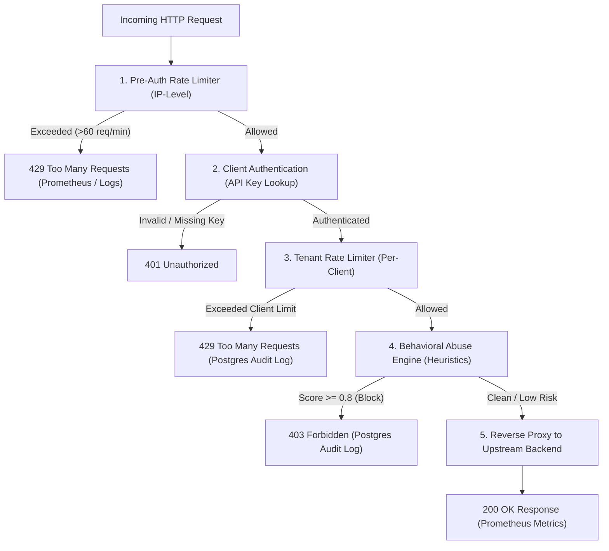

# Gargoyle Gateway — Architecture, Simulation Analysis & Design Decisions

This document provides a comprehensive, easy-to-understand breakdown of how **Gargoyle** works, why the system produced the exact outputs observed during the traffic simulation, and the core architectural decisions behind its design.

---

## 1. System Architecture & Request Lifecycle

Gargoyle sits in front of backend applications as a reverse proxy, inspecting every incoming request in a strict, multi-layered pipeline:



### The Middleware Layers

1. **Pre-Auth IP Rate Limiter (`PreAuthMiddleware`)**:
   * Inspects the client's IP address (`127.0.0.1`) before looking up API keys.
   * Drops high-volume volumetric floods at the edge with zero database load.
2. **Client Authentication (`client.Middleware`)**:
   * Extracts the `X-Gargoyle-Key` header, hashes it, and looks up the client in memory (cached with a 30-second TTL from PostgreSQL).
   * Attaches the authenticated `client_id`, `rate_limit`, and `target_url` to the request context.
3. **Tenant Rate Limiter (`ratelimit.Middleware`)**:
   * Uses Redis sliding-window counters to enforce per-client quotas (e.g. 60 requests/minute).
4. **Behavioral Abuse Engine (`abuse.Middleware`)**:
   * Evaluates the request against heuristic rules:
     * **Header Anomaly Rule**: Catches automated tools (`python-requests`, `curl`, `Scrapy`, `sqlmap`, `headlesschrome`) and missing headers.
     * **Endpoint Sweep Rule**: Tracks distinct paths visited by an IP/client within a sliding 10-second window in Redis.
     * **Request Sequencing Rule**: Analyzes inter-arrival time intervals; flags robotic fixed-interval pacing with low standard deviation.
5. **Reverse Proxy (`proxy.New`)**:
   * Dynamically forwards allowed requests to the client's target backend (e.g. `http://localhost:9000`).

---

## 2. Simulation Results & Traffic Behavior

When running simulated traffic in mixed mode (a combination of normal browser traffic, scraping tools, endpoint sweeps, and rapid requests), traffic resolves into three distinct outcomes:

### Summary Breakdown

| Outcome | HTTP Status | Recorded Where | Behavior |
| :--- | :--- | :--- | :--- |
| **Allowed Traffic** | `200 OK` | **Prometheus Metrics** (`/metrics`) | Legitimate browser requests with natural human jitter and valid headers pass through to the backend. |
| **Blocked Abuse** | `403 Forbidden` | **Postgres `request_logs`** | Malicious patterns (automated scraper User-Agents, rapid path scanning, and robotic timing uniformity) are caught and blocked by heuristic rules. |
| **Rate-Limited Traffic** | `429 Too Many Requests` | **Prometheus Metrics** & stdout logs | High-frequency request bursts exceeding configured rate limits are throttled at the edge to protect infrastructure. |

---

### How the System Reacts to Mixed Traffic

* **Legitimate Traffic**: Normal requests from genuine browser clients with natural delays and standard headers are validated and cleanly reverse-proxied to the upstream backend.
* **Heuristic Abuse Blocking**: When attack traffic introduces scraping tool signatures (e.g. `python-requests`, `curl`, `Scrapy`, `sqlmap`, headless browsers) or attempts to scan across multiple distinct endpoints, the abuse engine identifies the behavior and returns `403 Forbidden`, saving an audit record to PostgreSQL.
* **Active Protection State**: Once an IP address triggers an endpoint sweep by enumerating paths rapidly, subsequent requests from that source are temporarily blocked during the sliding detection window.
* **Edge Throttling**: If incoming traffic from an IP exceeds the pre-authentication rate limit, the edge limiter returns `429 Too Many Requests`, shielding both the database and backend services from high-velocity bursts.

---

## 3. Key Design Decisions Explained

### Decision 1: Why We Have Three Separate Data Stores

| Data Store | What It Stores | Why |
| :--- | :--- | :--- |
| **`ground_truth.csv`** (Simulator Output) | Raw request telemetry + `true_label` (`normal`, `endpoint_sweep`, etc.) | **Machine Learning Training Dataset**. Contains 100% of what was sent, completely independent of the gateway's internal rules. |
| **Postgres `request_logs`** | Blocked/throttled decisions per authenticated `client_id` | **Tenant Dashboard Audit Log**. Shows customers why their traffic was blocked. Clean requests are excluded to prevent database write overload. |
| **Prometheus (`/metrics`)** | Aggregated time-series counters & histograms | **System Observability**. High-throughput metrics with zero relational database overhead. |

> **Why ML training data comes from `ground_truth.csv`, not Postgres:**
> If you train an ML model on Postgres `request_logs`, the model would only learn to mimic the gateway's own if-statements (including any heuristic errors). Training on `ground_truth.csv` allows the model to learn the *actual ground truth* from raw features.

---

### Decision 2: Why `client_id` is `NOT NULL` in `request_logs`

A common question is: *Why not write the 40 pre-auth rate-limited requests into Postgres as well?*

1. **Protection Against Database Write-Amplification (DoS Attacks)**:
   * Dropping an unauthenticated volumetric flood in Redis/memory takes **< 0.1ms**.
   * If every pre-auth rejection triggered an `INSERT` into PostgreSQL, an attacker sending 50,000 requests/sec would crash the PostgreSQL database.
2. **Multi-Tenant Data Isolation**:
   * A customer logging into the dashboard queries: `SELECT * FROM request_logs WHERE client_id = :id`.
   * Unauthenticated requests have no `client_id` and would never appear in a tenant's dashboard anyway.
3. **Observability via Prometheus**:
   * Pre-auth drops are already tracked in `gargoyle_requests_total{outcome="rate_limited"}` without stressing PostgreSQL.

---

### Decision 3: Sub-Millisecond Live ML Inference via Redis

When the Machine Learning layer runs live inference inside Go:
* It does **not** query PostgreSQL for features (which would add 10–20ms of database latency per request).
* It computes features on the fly using in-memory request data and **Redis sliding-window counters** (`requests_last_60s`, endpoint diversity counters), keeping total gateway overhead under **2ms**.

---

## 4. How Heuristic Abuse Scoring Works

Each heuristic rule produces an abuse confidence score between `0.0` and `1.0`:

* **`HeaderAnomalyRule`**:
  * Scraper / attack signatures (`python-requests`, `go-http-client`, `sqlmap`, `scrapy`): **Score = 0.90** $\rightarrow$ **Block (403)**
  * Headless browsers (`HeadlessChrome`, `puppeteer`, `playwright`): **Score = 0.85** $\rightarrow$ **Block (403)**
  * Missing `User-Agent`: **Score = 0.85** $\rightarrow$ **Block (403)**
  * Browser User-Agent without standard `Accept` header: **Score = 0.80** $\rightarrow$ **Block (403)**
* **`EndpointSweepRule`**:
  * Distinct paths visited in 10s > 10: **Score = 0.90** $\rightarrow$ **Block (403)**
* **`RequestSequencingRule`**:
  * Inter-arrival standard deviation < 15ms across $\ge 5$ requests: **Score = 0.85** $\rightarrow$ **Block (403)**

*If any rule reaches or exceeds the threshold (`GARGOYLE_ABUSE_BLOCK_THRESHOLD=0.8`), the request is blocked and logged to Postgres.*

---

## 5. How to Reproduce and Inspect

### 1. Start Services
```bash
# Start Redis
docker run -d --name gargoyle-redis -p 6379:6379 redis:alpine

# Start Upstream Test Backend (Terminal 1)
go run ./cmd/dummybackend

# Start Gargoyle Gateway (Terminal 2)
go run ./cmd/gargoyle
```

### 2. Run the Traffic Simulator (Terminal 3)
```bash
# Run 100 mixed requests
python3 ../tools/simulator/simulate.py \
    --target-url http://localhost:8080 \
    --api-key "<YOUR_API_KEY>" \
    --mode mixed \
    -n 100 \
    -o ground_truth.csv
```

### 3. Query PostgreSQL Audit Logs
```sql
-- View all blocked decision audit logs
SELECT timestamp, path, outcome, abuse_score, reason 
FROM request_logs 
ORDER BY timestamp DESC;

-- View breakdown by outcome
SELECT outcome, count(*) 
FROM request_logs 
GROUP BY outcome;
```

### 4. Check Prometheus Metrics
```bash
curl -s http://localhost:8080/metrics | grep gargoyle_requests_total
```
